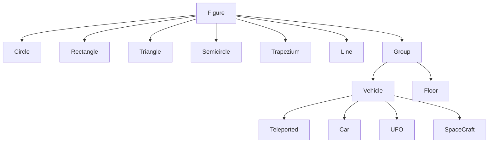

# Animation of Interstellar Car Park

## Project Info

This is a project using C++ and OpenGL to simulate the process of parking and taking out vehicles in an interstellar car park. The project is divided into two parts: Part A is the normal parking lot manager, and Part B is the interstellar car park.

Note that the project is group project of four, I am only one of the contributors. As I like to keep code on GitHub, I have uploaded the code here. But if you find I Infringed upon your rights, please feel free to contact me.

## Part A: Normal Parking Lot Manager

- This part is the basic model of a normal parking lot.
- It can park and take out vehicles.
- Allows printing a hint when a vehicle is parked and prints the leaving ticket for the corresponding vehicle to leave.
- A stimulation function is used to simulate the process of parking and taking out vehicles.
- Uses inheritance and polymorphism to calculate the fees for different types of vehicles.

## Part B: Interstellar Car Park

### Hierarchy Diagram

### Content

- this part is the complete simulation of an interstellar car park
- it can park and take out vehicles
- each time either an existing vehicle moves or it randomly decides whether to create a new vehicle
- the new generated vehicle has a random type of the four types
- stimulate functions are used to stimulate the process of parking and taking out vehicles
